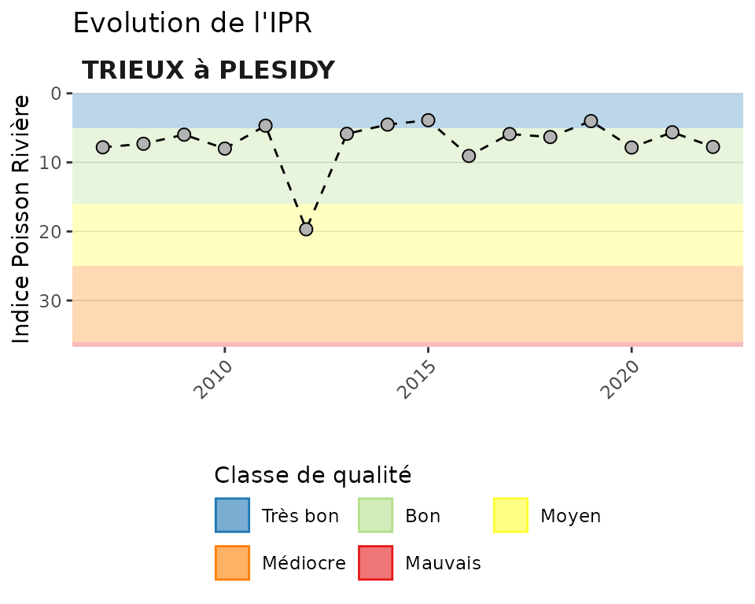
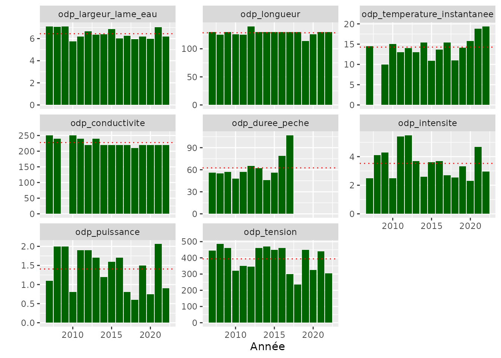

# 3. Produire une fiche station

## Objectif

Il s’agit de construire, à partir des données de la base Aspe, une fiche
station rassemblant plusieurs indicateurs soit pour la dernière
opération réalisée, soit en tendance interannuelle.

Le détail des premières étapes de constitution des tables sont donnés
dans les autres vignettes.

## Activation des packages et chargement des données

``` r
library(aspe)
library(tidyr)
library(ggplot2)
library(forcats)
library(dplyr)
```

``` r
misc_charger_donnees_test()
# load(file = "../../../raw_data/rdata/tables_sauf_mei_2023_04_07_09_39_32.RData")
```

## Le peuplement

### Construction du `dataframe` de base

On choisit ici à titre d’exemple la station avec le `sta_id` 10925, Le
Trieux à Plésidy.

``` r
aspe <- aspe::mef_creer_passerelle() %>% 
  filter(sta_id == 10844) %>% 
  mef_ajouter_ope_date() %>% # ajout de la date
  mef_ajouter_libelle() %>% # ajout des libellés station
  mef_ajouter_lots() # ajout des lots
```

Agrégation des captures à l’opération et calcul de la densité.

``` r
ope_capt <- aspe %>%  
  group_by(sta_id,
           pop_id,
           pop_libelle,
           ope_date,
           ope_id,
           annee,
           esp_code_alternatif) %>% 
  summarise(effectif = sum(lop_effectif)) %>% 
  ungroup() %>% 
  mef_ajouter_surf_calc() %>% # ajout de la surface prospectée 
  mutate(effectif = replace_na(effectif, 0),
         densite = 1000 * effectif / ope_surface_calculee) %>% # calcul densité
  droplevels() %>% 
  mef_ajouter_type_protocole() # 
```

### Dynamique du peuplement

``` r
aspe::gg_temp_peuplement(df = ope_capt, var_id_sta = pop_id, var_libelle_sta = pop_libelle)
```


## Etat du milieu

### L’IPR

#### Construction du tableau

``` r
ipr_station <- aspe %>%
  select(ope_id,
         annee,
         pop_libelle) %>% 
  distinct() %>% 
  mef_ajouter_ipr()
```

#### Graphique

La fonction
[`ip_completer_classes_couleur()`](https://pascalirz.github.io/aspe/reference/ip_completer_classes_couleur.md)
sert à ajouter le code couleur qui convient à chaque classe de qualité
en vue de produire ’arrière-plan du graphique.

``` r
classe_ipr <- classe_ipr %>% 
  ip_completer_classes_couleur()
```

On produit ensuite le graphique avec la fonction
[`gg_temp_ipr()`](https://pascalirz.github.io/aspe/reference/gg_temp_ipr.md).

``` r
gg_temp_ipr(df_ipr = ipr_station,
            var_id_sta = pop_libelle,
            var_ipr = ipr,
            max_axe_y = 35,
            df_classes = classe_ipr)
```



### Les métriques IPR

#### Construction du tableau

``` r
metriques_station <- aspe %>%
  select(ope_id,
         annee,
         pop_libelle) %>% 
  distinct() %>% 
  mef_ajouter_metriques() %>% 
  select(-(ner_theorique:dti_observe)) %>% 
  pivot_longer(cols = ner:dti,
               names_to = "metrique",
               values_to = "valeur")
```

#### Graphiques

Avec la fonction
[`gg_temp_metriq()`](https://pascalirz.github.io/aspe/reference/gg_temp_metriq.md)
il est possible de représenter sur un même graphique les 7 métriques
constitutives de l’IPR et de bien visualiser celles qui sont
déclassantes.

``` r
gg_temp_metriq(
  df_metriques = metriques_station,
  var_id_sta = pop_libelle,
  var_nom_metrique = metrique,
  var_valeur_metrique = valeur,
  df_classes = classe_ipr
)
```


On peut préférer la fonction
[`gg_temp_metriq_grille()`](https://pascalirz.github.io/aspe/reference/gg_temp_metriq_grille.md)
pour mieux visualiser les tendances par métrique.

``` r
gg_temp_metriq_grille(
  df_metriques = metriques_station,
  var_id_sta = pop_libelle,
  var_nom_metrique = metrique,
  var_valeur_metrique = valeur
)
```


## Variables environnementales

### Préparation des données

On prépare un dataframe dans un format qui permettra ensuite de produire
la présentation graphique des données environnementales qui varient
d’une opération de pêche à une autre :

- Ajout des données environnementales au dataframe de base avec les
  fonctions
  [`mef_ajouter_ope_env()`](https://pascalirz.github.io/aspe/reference/mef_ajouter_ope_env.md)
  et
  [`mef_ajouter_ope_desc_peche()`](https://pascalirz.github.io/aspe/reference/mef_ajouter_ope_desc_peche.md)
- Passage en format “long”
- Mise dans l’ordre souhaité des variables à représenter

``` r
env_station <- aspe %>%
  select(pop_id,
         ope_id,
         annee,
         pop_libelle) %>% 
  distinct() %>% 
  mef_ajouter_ope_env() %>% 
  mef_ajouter_ope_desc_peche() %>% 
  select(annee, odp_duree_peche:odp_puissance) %>% 
  pivot_longer(cols = odp_duree_peche:odp_puissance,
               names_to = "variable",
               values_to = "valeur") %>% 
  mutate(variable = as.factor(variable),
         variable = fct_relevel(variable,
                                "odp_largeur_lame_eau",
                                "odp_longueur",
                                "odp_temperature_instantanee"))
```

Calul des moyennes interannuelles par variable.

``` r
moyennes <- env_station %>% 
  group_by(variable) %>% 
  summarise(moyenne = mean(valeur, na.rm = TRUE))
```

### Présentation graphique

``` r
ggplot(data = env_station,
       aes(x = annee,
           y = valeur)) +
  geom_bar(stat = "identity",
           fill = "darkgreen") +
  facet_wrap(~variable, scales = "free_y") +
  geom_hline(data = moyennes,
             aes(yintercept = moyenne),
             linetype = "dotted",
             col = "red") +
  labs(x = "Année",
       y = "")
```


