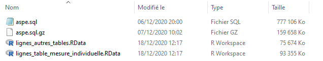

```{r, include = FALSE}
knitr::opts_chunk$set(
  collapse = TRUE,
  comment = "#>"
)
```

Activation du package `{aspe}` et des autres qui sont nécessaires pour exécuter les scripts

```{r setup, message = FALSE, warning = FALSE}
library(aspe)
library(tidyverse)
```

# Comment procéder ?

## Pour les chanceux

Si on dispose d'une machine avec assez de mémoire (16Go de RAM) on importe la totalité de la base en une fois, ce qui est bien pratique.

```{r, eval = FALSE}
importer_dump_sql(fichier_dump = "raw_data/aspe.sql")
```

## Pour les moins chanceux

Si on a une machine moins performante, la mémoire ne permettra pas de stocker simultanément le gros fichier texte du *dump* et les *dataframes.* Il faudra procéder en deux étapes.

Une des tables, nommée `mesure_individuelle`, comprend à elle seule plus de lignes que la totalité des autres qui sont plus d'une centaine. 

La première étape est de scinder le dump en deux parties qui seront stockées en format `.RData` :

- Le premier fichier contient les lignes du *dump* correspondant à la table `mesure_individuelle`.
- Le second contient le reste des lignes.

```{r, eval = FALSE}
scinder_dump(fichier_dump = "raw_data/aspe.sql")
```

Si ça a bien fonctionné on trouve dans le répertoire de destination (par défaut celui où se trouve le fichier du *dump*) les deux fichiers `.RData`.



On peut ensuite importer les tables elles-mêmes.

```{r, eval = FALSE}
importer_tables_a_partir_des_lignes(lignes_dump = "raw_data/lignes_autres_tables.RData")
```

